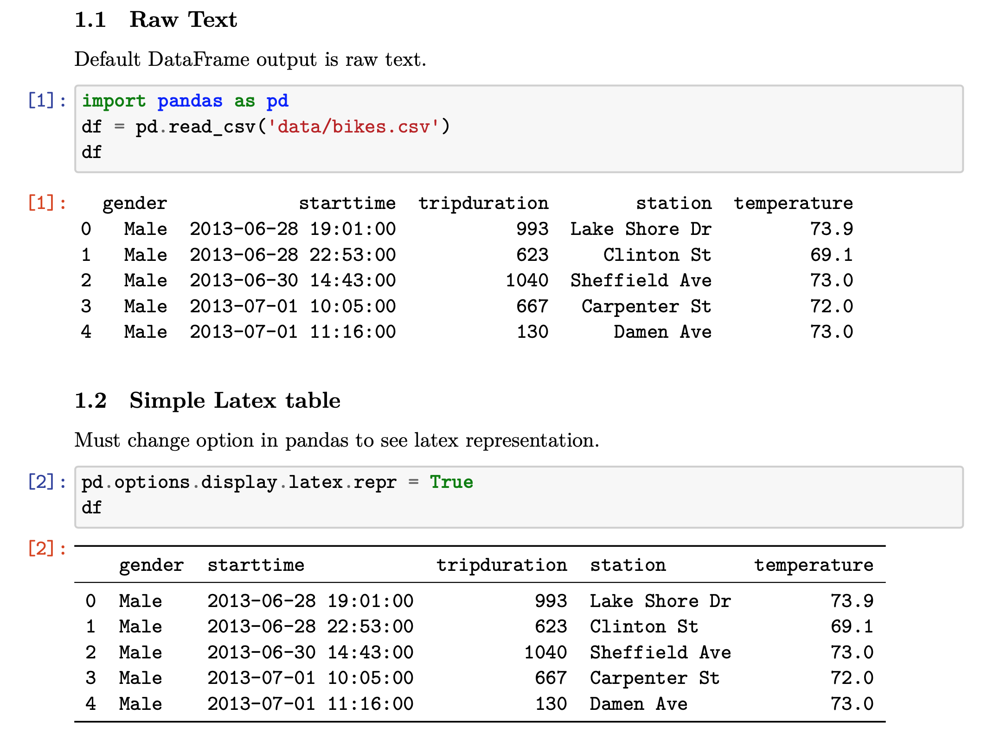
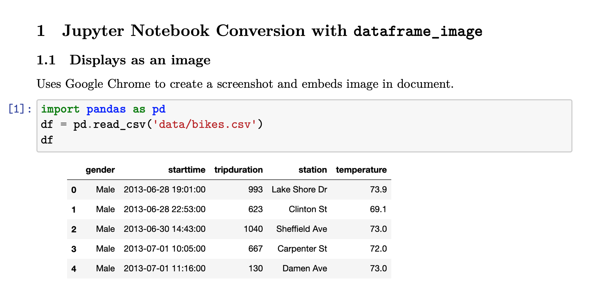

# dataframe_image

A package to embed pandas DataFrames as images when convert Jupyter Notebooks to pdf or markdown documents. 

## Motivation

When converting Jupyter Notebooks to pdf using nbconvert, pandas DataFrames appear as either raw text or as a simple latex table. Below, we have a pdf showing both the plain text and latex DataFrame representation.



This package was created to embed DataFrames into pdf and markdown documents as images so that they appear exactly as they do in a Jupyter Notebook. Here, the same DataFrame as above is shown in a pdf converted using dataframe_image.



## Installation

`pip install dataframe_image`

## Usage

In a separate Python script, import the `dataframe_image` package and pass the file name of your notebook to the `convert` function.

```python
>>> import dataframe_image as dfi
>>> dfi.convert('path/to/your_notebook.ipynb',
                to='pdf',
                max_rows=30,
                max_cols=10,
                ss_width=1000,
                ss_height=900,
                resize=1,
                chrome_path=None,
                limit=None
                )
```

The new file(s) will be saved in the same directory where the notebook resides. dataframe_image will automatically find the location of chrome on Windows, macOS, and Linux. Set the `to` parameter to `'md'` to convert to markdown.

## Dependencies

You must have the following python libraries installed

* [pandas](https://github.com/pandas-dev/pandas)
* [nbconvert](https://github.com/jupyter/nbconvert) which requires latex, xelatex, and pandoc
* [pillow](https://github.com/python-pillow/Pillow)

You must also have Google Chrome installed.
