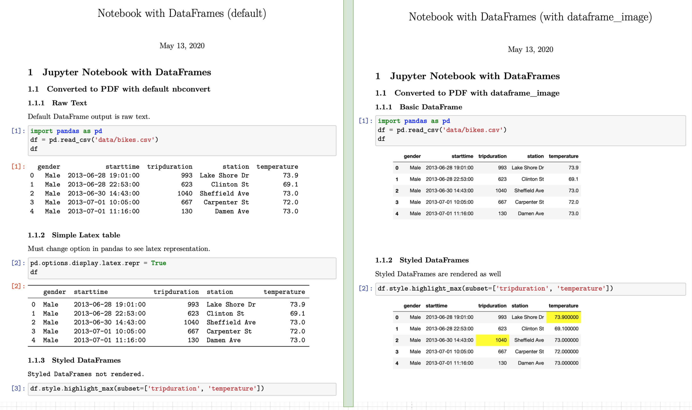
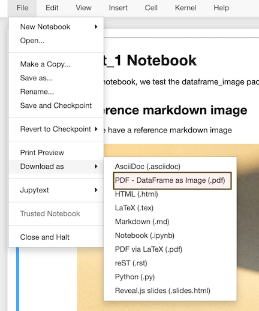

# dataframe_image

A package to convert Jupyter Notebooks to either PDF or Markdown documents with the following extra functionality not provided directly by nbconvert:

* Embedding pandas DataFrames into the final PDF or Markdown as they appear in the notebook
* Downloading the notebook as a PDF appearing exactly as it does in your browser (using the print as PDF feature from chrome)
* Extracting all images in markdown (inline, reference, attachments, and `` tags)
* Allowing the new document to be saved anywhere in your filesystem and correctly linking to resources

## Motivation

When converting Jupyter Notebooks to pdf using nbconvert, pandas DataFrames appear as either raw text or as a simple latex table as seen on the left side of the image below.



This package was first created to embed DataFrames into pdf and markdown documents as images so that they appear exactly as they do in a Jupyter Notebook, as seen on the right side of the image above. It has since added much more functionality.

## Installation

`pip install dataframe_image`

## Usage

There are three different ways to use dataframe_image:

* Within a Jupyter Notebook
* As a Python library
* From the command line

To get access to all of the available options, use it as a library or from the command line. Using it within the notebook allows you to download the notebook as PDF via latex or via the browser.

### Within a Jupyter Notebook

Upon installation, two new options will appear in your Jupyter Notebook under `File -> Download as -> PDF - DataFrame as Image (via latex)` and `PDF - DataFrame as Image (via browser)`. Each option produces a distinctly different output. Using latex, a formal report with numbered sections will be returned. Using the browser, you'll get a near replica of how the notebook appears in your browser.

The conversion process is time consuming as screenshots of each DataFrame will be taken and then embedded into a pdf. A new blank tab will open during the processing. It will appear as nothing is happening. When processing is complete, the document will be downloaded. Converting via browser is significantly faster as it uses chromes built-in print-to-pdf capabilities.

When using this option, the notebook will NOT be executed. Make sure to execute the notebook first.



### As a Python Library

In a separate Python script, import the `dataframe_image` package and pass the file name of your notebook to the `convert` function. By default, a PDF using latex will be produced. Set the `use` option to 'browser' to get the other version. Using dataframe_image as a Python library provides you with all of the available options, including downloading as a Markdown document.

```python
>>> import dataframe_image as dfi
>>> dfi.convert('path/to/your_notebook.ipynb',
                to='pdf',
                use='latex',
                latex_command=None,
                max_rows=30,
                max_cols=10,
                ss_width=1000,
                ss_height=900,
                resize=1,
                chrome_path=None,
                limit=None,
                document_name=None,
                execute=True,
                save_notebook=False,
                output_dir=None,
                image_dir_name=None
                )
```

By default, the new file(s) will be saved in the same directory where the notebook resides.

Do not run this command within the same notebook that is being converted.

### From the Command Line

The command line tool `dataframe_image` will be available upon installation with the same options as the `convert` function from above.

```bash
dataframe_image --to=pdf "my notebook with dataframes.ipynb"
```

## Finding Google Chrome

You must have Google Chrome (or Brave) installed in order for dataframe_image to work. The path to Chrome will automatically be found. If Chrome is not in a standard location, set it with the `chrome_path` parameter.

## Publish to Medium (upcoming)

You can publish your notebooks as Medium blog posts by installing the [`jupyter_to_medium`](https://github.com/dexplot/jupyter_to_medium) package.

## Extras

This package also embeds any images added to markdown cells as **attachments** (done by dragging and dropping the image) as well as those referenced by HTML `` tags. It is also able to properly save the pdf/markdown and its images in a directory outside of where it is located.

## Dependencies

You must have the following python libraries installed:

* [pandas](https://github.com/pandas-dev/pandas)
* [nbconvert](https://github.com/jupyter/nbconvert) which requires latex, xelatex, and pandoc
* [pillow](https://github.com/python-pillow/Pillow)
* [aiohttp](https://docs.aiohttp.org/en/stable/index.html)

## Installing LaTeX

It is possible to use dataframe_image without a latex installation as long as you only download pdfs via browser. Consult [nbconvert's documentation](https://nbconvert.readthedocs.io/en/latest/install.html#installing-tex) to learn how to get latex installed correctly on your machine.
